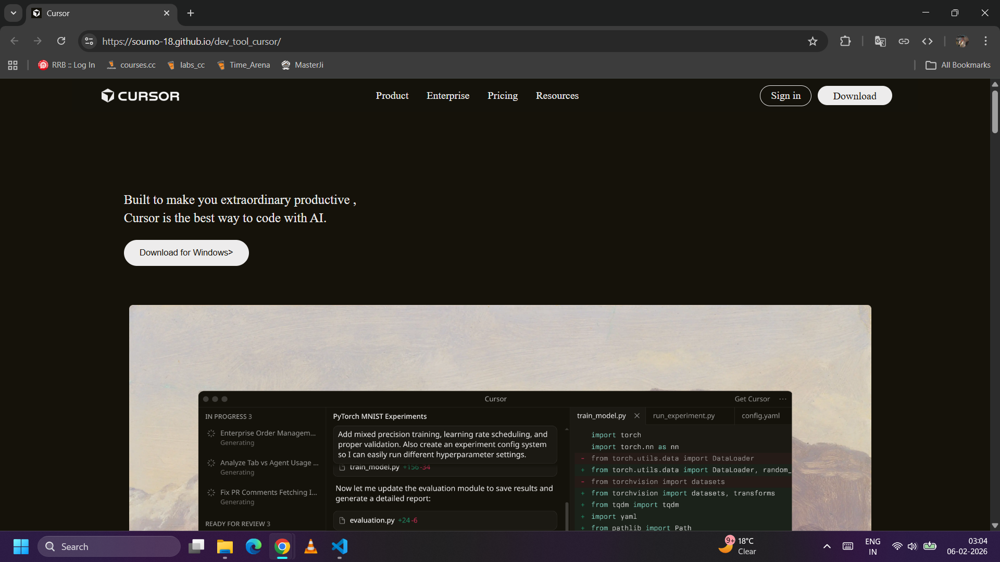
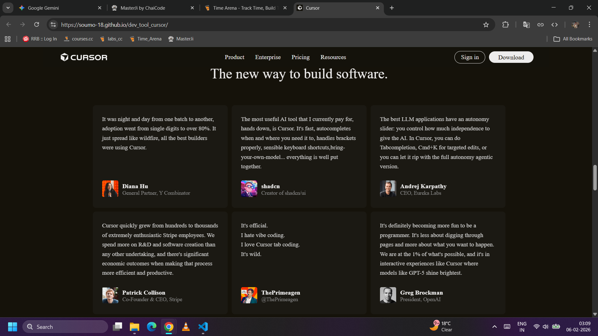
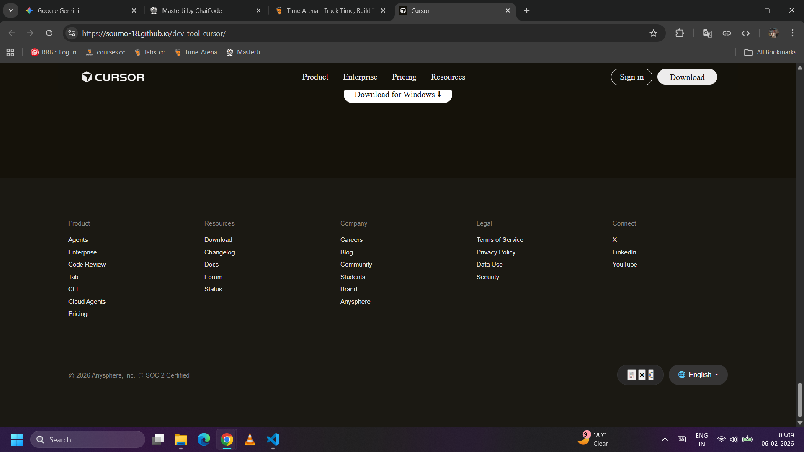

# Cursor Landing Page Clone

A pixel-perfect recreation of the [Cursor.com](https://cursor.com) landing page, built to demonstrate modern CSS mastery.

**🔗 Live Demo:** [https://soumo-18.github.io/dev_tool_cursor/](https://soumo-18.github.io/dev_tool_cursor/)

## 📝 Project Overview
This project is a desktop-first implementation of the Cursor AI code editor website. The goal was to replicate the exact design, typography, spacing, and interactive elements of the original site without relying on external CSS frameworks like Bootstrap or Tailwind.

### ✅ Recreated Sections
* **Sticky Navigation Bar**: Implemented `position: sticky` with a translucent background and Z-index layering.
* **Hero Section**: Complex background positioning with centered typography and call-to-action buttons.
* **"Trusted By" Section**: Flexbox alignment for partner logos.
* **Bento Grids**: Custom CSS Grid layouts for the "Frontier" and "Changelog" sections.
* **Testimonials**: A responsive 3-column grid layout.
* **Footer**: A robust 5-column layout with a custom "pill-shaped" bottom bar for theme/language settings.

## 🎨 Design System

### Fonts
* **Primary Font**: `Cursor` (Custom font face loaded via local assets)
* **Fallback**: `sans-serif` system fonts

### Colors
* **Primary Background**: `#15120a` (Deep dark brown/black)
* **Card Background**: `#1b1913`
* **Text Color**: `#EDECEC` (Primary) & `#999` (Secondary)
* **Accent Color**: `#ff4d00` (Used for links and hover states)

## 📸 More Screenshots

### Feature Grid

### Footer Section

## 💻 Tech Stack
* **HTML5** (Semantic Structure)
* **CSS3** (Flexbox, Grid, Variables, Sticky Positioning)